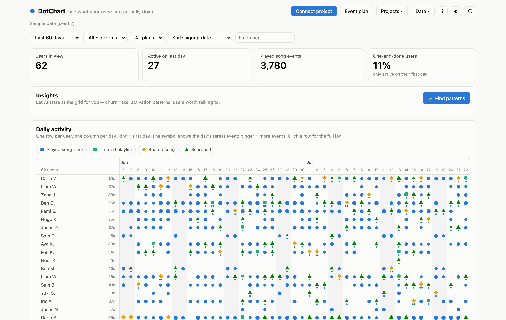

# DotChart

**See what your users are actually doing.** A dot-plot-first product analytics
tool with an AI scanner that reads your codebase, proposes the events worth
tracking, and writes the instrumentation for you — on a git branch, with your
review.

<picture>
  <source media="(prefers-color-scheme: dark)" srcset="docs/screenshot-dark.png">
  
</picture>

## Why a dot plot?

Aggregate dashboards hide your users. A DAU line can stay flat while your best
customer quietly churns. DotChart uses the technique David Lieb (Bump, Google
Photos) credits for saving his products: a 2D grid where **every row is one
user and every column is one day** — so weekday-vs-weekend clusters,
one-and-done churners, feature-triggered streaks, and fading accounts are
*visible*, the way no aggregate chart can show them.

The hard part of analytics was never the chart — it's knowing **what to
track** and actually wiring it up. That's the part DotChart automates.

## Quickstart

**Use a hosted DotChart** (the primary way): open your team's instance,
sign up, and connect your project — accounts keep every user's projects
and data separate, and each project gets its own ingest URL. No account
yet? The login screen has a full **live demo** you can explore first.

**Or run your own:**

```sh
git clone https://github.com/kevingduck/dot_plot.git && cd dot_plot
npm install && npm run dev
```

All data stays in `~/.dotchart` on your machine. To serve a multi-user
instance for your team, see [self-hosting](docs/self-hosting.md) —
`DOTCHART_AUTH=1` enables accounts. (`npx dotchart-analytics` packaging
is prepped and coming to npm.)

## How it works — from zero to tracked in four steps

1. **Connect your project.** Pick a folder (or paste a GitHub URL — private
   repos work via a one-time token, never stored). DotChart detects the
   framework, finds the database connection in the repo's env files (used
   **read-only**, with your consent), and runs one AI pass over the code and
   the live schema.
2. **Review the proposed event plan.** A ranked plan of value / activation /
   feature events — you accept, reject, or re-tier each one. Every event is
   labeled either **"already in your database · table"** or **"needs a
   one-line code change"**.
3. **See your users.** *Show me my users* charts the database-backed events
   immediately — zero code changes. For the rest, **⚡ Start tracking**
   drafts minimal `track()` edits, shows you every diff, and commits only
   what you approve to a fresh `dotchart/*` branch (your working tree is
   never touched; it refuses dirty trees). Merge the branch, set one env var
   — `DOTCHART_INGEST_URL` — and events flow onto the grid within ~15
   seconds. Until that var is set the merged code is a guaranteed no-op.
4. **Find patterns.** ✨ asks the AI to do the PayPal-fraud-wall job: churn
   risks, activation hypotheses, users worth interviewing — each insight
   clickable to highlight those users on the grid.

Every step shows its state honestly: each planned event reads
**● reporting data**, **◐ in your database**, or **○ no events yet**, so you
always know what's actually wired up.

## Bring your own AI

- **Claude** (default, recommended) — Sonnet 5, or Opus 4.8 for gnarly
  codebases.
- **OpenAI** — GPT-5.6 Terra/Luna, or type any model id.
- **Local & free via [Ollama](https://ollama.com)** — no key, no cost,
  nothing sent to a cloud AI. Works even against a *hosted* DotChart: the
  browser calls your local Ollama directly.

The wizard's one-time "Choose your AI" step auto-detects a running Ollama;
keys live only in your browser (or in the server's env for teams). Every
analysis reports its actual cost — typically a few tens of cents on cloud
models, free locally.

## What's in the grid

- The **symbol** in a cell is the day's *rarest* event, so high-signal
  moments (created a playlist) stay visible on days the core event also
  happened; mark size steps with volume, mini-dots show the day's other
  events, and a **ring** marks each user's first day.
- Sort by signup date, active days, recency, or streak; filter by date
  range, platform, plan, or search; click a row for the full per-user log.
- **Cohort retention** curves ride below the grid — only weeks a cohort has
  fully lived through are charted, so partial tails can't fake a spike.

## More ways in

- **CSV import/export** — `user_id,event,timestamp[,name,platform,plan,country]`
  and the grid lights up; no code, no database.
- **Read-only Postgres import** — the session runs with
  `default_transaction_read_only=on` (Postgres itself rejects writes); you
  approve every table mapping, and **↻ Refresh** re-imports on demand.
- **Ingest API** — `POST /ingest` on the app's own origin: CORS-open,
  batched, validated, capped. Anything that can send JSON can be charted.
- **Per-project workspaces** — every connected project's data, plan, and
  insights autosave and switch instantly from the Projects menu.

## Self-hosting

An always-on dashboard plus a stable ingest URL for production apps:

[](https://render.com/deploy?repo=https://github.com/kevingduck/dot_plot)

```sh
# Docker
docker build -t dotchart . && docker run -p 5300:5300 \
  -v dotchart-data:/root/.dotchart -e DOTCHART_HOSTED=1 \
  -e DOTCHART_PASSWORD=changeme dotchart

# or any Node host
npm ci && npm run build
DOTCHART_HOSTED=1 DOTCHART_PASSWORD=… npm start
```

Set `DOTCHART_PASSWORD` on any public deployment — everything except
`/ingest` and `/health` locks behind it. Optional `ANTHROPIC_API_KEY` /
`OPENAI_API_KEY` give the team shared AI; otherwise users bring their own
key (or their own Ollama) in Settings. Hosted mode keeps machine-local
features (server-side folder browsing, git branches, localhost databases)
disabled; connect via GitHub or the browser folder picker, which uploads
only a filtered code digest.

## Documentation

Every DotChart serves its own docs at `/docs` — the **?** button in the top
bar opens them in a new tab (open even on password-protected deployments).
Same pages in [`docs/`](docs/): [getting started](docs/getting-started.md) ·
[connect your project](docs/connect-your-project.md) ·
[reading the grid](docs/reading-the-grid.md) ·
[AI providers & models](docs/api-keys-and-models.md) ·
[instrumentation](docs/instrumenting-your-code.md) ·
[live tracking](docs/live-tracking.md) · [CSV import](docs/csv-import.md) ·
[self-hosting](docs/self-hosting.md) ·
[troubleshooting](docs/troubleshooting.md)

## Roadmap

✅ Dot-plot viewer · ✅ AI codebase scanner + plan review · ✅ Branch-based
instrumentation · ✅ Read-only DB import + refresh · ✅ Connect wizard ·
✅ Live ingest · ✅ AI insights · ✅ Hosted mode · ✅ Multi-provider AI
(Claude / OpenAI / Ollama). Next: SQLite store, Python `track()` client,
Segment/PostHog adapters, B2B accounts view, alerting.
